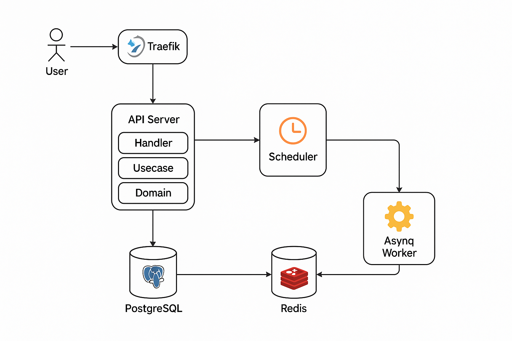

# go-hris

A scalable, modular payroll and HRIS backend system built with **Go**, **PostgreSQL**, and **Redis**. Designed for real-world scenarios with support for background job processing, request auditing, structured logging, and concurrency-safe data handling.

---

## 🧭 Architecture Diagram

The following diagram illustrates the high-level system architecture of the Go-HRIS Payroll System:



It shows the interaction between components such as Traefik, API Server, Scheduler, Asynq Worker, Redis, and PostgreSQL.

---

## ✨ Features

- RESTful APIs with JSON
- JWT-based authentication
- Clean architecture (domain → usecase → handler separation)
- Background job queue with **Asynq** for batch payroll
- Scheduled attendance period closing
- Optimistic locking for high-concurrency safety
- Structured JSON logging with `request_id` for traceability
- Auto-generated Swagger docs at `/swagger/index.html`
- Dockerized for easy local setup
- Load testing with K6
- Unit testing (42% coverage as of now)
- Traefik reverse proxy for simulated multi-instance deployment

---

## 🔧 Tech Stack

- **Golang**
- **PostgreSQL**
- **Redis** (for Asynq and scheduling)
- **Asynq** for job queue & scheduled tasks
- **Docker** & **Docker Compose**
- **Traefik** for local reverse proxy
- **Swagger** for API documentation
- **Cobra** for CLI commands
- **GORM** for ORM and migrations
- **K6** for load testing

---

## 🚀 Getting Started

### 1. Clone & Configure

```bash
git clone https://github.com/yourusername/go-hris.git
cd go-hris
cp .env.example .env
```

### 2. Run with Make (Local Dev)

```bash
make seed             # Seed initial data
make start            # Start the main API server
make start-worker     # Start Asynq worker for payroll processing
make start-scheduler  # Start scheduled tasks (attendance period, job check)
```

### 3. Run with Docker

```bash
docker-compose up --build
```

---

## 📌 API Endpoints

All APIs return JSON and require authentication (except `login` and `register`).

| Endpoint                         | Description                                        |
| -------------------------------- | -------------------------------------------------- |
| `POST /login`                    | Login (JWT)                                        |
| `POST /register`                 | Register a new user                                |
| `POST /api/attendance/checkin`   | Record check-in                                    |
| `POST /api/attendance/checkout`  | Record check-out                                   |
| `POST /api/attendance/overtime`  | Submit overtime                                    |
| `POST /api/reimbursement/submit` | Submit reimbursement                               |
| `POST /api/payroll/create`       | Manually trigger payroll (also done via scheduler) |
| `GET /api/payslip`               | Get payslip                                        |
| `GET /api/payroll/summary`       | Get payroll summary                                |
| `GET /api/attendance/period`     | View attendance periods                            |

Explore all endpoints at:  
**`http://localhost:8080/swagger/index.html`**

---

## 🔐 Auth & Traceability

- **JWT** authentication via `/login`
- Middleware stores:
  - `created_by`, `updated_by`
  - `created_at`, `updated_at` in DB
  - Request `IP address` for traceability
  - `request_id` injected into logs

Example log:

```json
{
  "level": "info",
  "xtime": "2025-06-11T09:19:54.791+0700",
  "msg": "HTTP Request",
  "path": "/login",
  "method": "POST",
  "correlation_id": "8903f7cf-...",
  "status": 200,
  ...
}
```

---

## 🧠 Architecture & Internals

### Structure

- `domain/` – interfaces and model contracts
- `usecase/` – business logic
- `handler/` – HTTP layer, worker, scheduler
- `cmd/` – CLI commands (`db_seeder.go`, etc.)
- `pkg/` – middleware, JWT, utils, etc.

### Job Processing with Asynq

- Payroll is generated via scheduled jobs.
- Jobs are stored and tracked in `payroll_job` table.
- Optimistic locking is used instead of row locking, making the system resilient to retries and failures in batch execution.

---

## 🧪 Testing

- **Unit tests**: run with coverage

  ```bash
  make test   # or make coverage
  ```

- **Load testing**: run with [K6](https://k6.io)
  ```bash
  k6 run loadtest/script.js
  ```

---

## ⚠️ Known Limitations

- Audit logs are not stored in a dedicated table; important actions are instead handled by machines (scheduler/worker).
- Prometheus/Grafana not integrated, but logs are ready for parsing/exporting (e.g. via Loki/Jaeger).
- Current test coverage: **~42%** (excluding `payroll/create`)

---

## 🙌 Bonus Implementation Highlights

- Cobra CLI commands for admin tasks
- `make` commands simplify workflow
- Traefik reverse proxy configured in Docker Compose for multi-instance testing

---

## 📄 License

MIT – Feel free to use, fork, and build upon this project.

---

## 👤 Author

Umam – Software Engineer, Backend (Golang)
